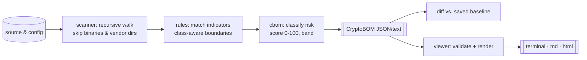

<div align="center">


# QuantumSeal · migration observatory

**A crypto-inventory instrument for the post-quantum transition.** Point it at a
tree of source and config, and it charts every recognizable cryptographic
name — RSA, ECC, MD5, ML-KEM, TLS — as a scored **CryptoBOM** (Cryptographic
Bill of Materials). A companion viewer renders that dossier as a terminal,
Markdown, or HTML briefing. Diff two scans to watch a migration close.

[](https://github.com/chuangtian/QuantumSeal/actions/workflows/ci.yml)


<em>Rust CLI (stdlib only, zero deps) · TypeScript viewer (Node stdlib only)</em>

</div>

> [!CAUTION]
> **quantumseal reads text. It never runs cryptography.**
> It does not implement, execute, break, benchmark, or evaluate any cipher,
> and it is **not** a security audit or a post-quantum crypto library. A finding
> means a known cryptographic *name* appears on a line of a file — a coordinate
> for human review, not a verdict on whether that code is safe. Absence of a
> finding is **not** evidence of safety.

---

## Flight plan (contents)

- [What the instrument charts](#what-the-instrument-charts)
- [Signal-to-orbit: how it works](#signal-to-orbit-how-it-works)
- [Getting the instrument running](#getting-the-instrument-running)
- [Console transcripts](#console-transcripts)
  - [Quick scan](#quick-scan)
  - [Baseline diff](#baseline-diff)
  - [Rendering a dossier](#rendering-a-dossier)
- [Risk taxonomy](#risk-taxonomy)
- [Priority scoring, explained](#priority-scoring-explained)
- [The CryptoBOM dossier](#the-cryptobom-dossier)
- [Indicator rules by example](#indicator-rules-by-example)
- [Migration workflow](#migration-workflow)
- [Report formats](#report-formats)
- [Fixture tour](#fixture-tour)
- [CI baseline recipe](#ci-baseline-recipe)
- [Reading the results well](#reading-the-results-well)
- [False positives & limitations](#false-positives--limitations)
- [Roadmap](#roadmap)
- [Layout & license](#layout--license)

---

## What the instrument charts

The threat is patient: *harvest now, decrypt later.* Data sealed today with
Shor-breakable public-key cryptography (RSA, ECC, finite-field Diffie-Hellman,
DSA) can be captured now and opened once a cryptographically-relevant quantum
computer exists. Migrating to the NIST PQC standards — ML-KEM (FIPS 203),
ML-DSA (FIPS 204), SLH-DSA (FIPS 205) — starts with a map of **where** your
cryptography actually lives.

quantumseal builds that map. It does **not** move you to PQC, and it makes no
claim to implement any of these algorithms; it recognizes their names to
*categorize and prioritize* the work ahead.

Two cooperating parts:

| Component | Language | Role | Dependencies |
| --- | --- | --- | --- |
| `quantumseal` | Rust | recursive scan → classify → score → emit CryptoBOM; diff vs. baseline | none (std only) |
| `@quantumseal/viewer` | TypeScript | validate a CryptoBOM and render terminal / Markdown / HTML | none (Node std only) |

---

## Signal-to-orbit: how it works

<div align="center">

</div>



Each line is lowercased once, tested against the indicator catalog, filtered by
boundary and line-level rules, then aggregated per component with a priority
score and a migration hint. Nothing is executed; the file is only ever read as
text.

---

## Getting the instrument running

```bash
# Rust CLI
cargo build --release          # -> target/release/quantumseal

# TypeScript viewer
cd viewer && npm install && npm run build   # -> viewer/dist/
```

Or drive everything through the Makefile:

```bash
make all      # build + test both halves
make demo     # full pipeline against the bundled fixtures
```

---

## Console transcripts

### Quick scan

```console
$ quantumseal scan fixtures/legacy_service
quantumseal — CryptoBOM (post-quantum migration inventory)
NOTE: static analysis of crypto indicators only; not a security audit.
======================================================================
Root:            fixtures/legacy_service
Tool:            quantumseal v0.1.0
Files scanned:   2
Components:      13
Occurrences:     30

----------------------------------------------------------------------
[ 97] MD5 — CRITICAL
      risk=critical_deprecated  category=hash  files=2  occurrences=3
      guidance: MD5 is collision-broken. Replace with SHA-256/SHA-3; ...
----------------------------------------------------------------------
[ 80] RSA — HIGH
