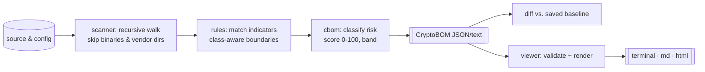

<div align="center">


# QuantumSeal · migration observatory

**A crypto-inventory instrument for the post-quantum transition.** Point it at a
tree of source and config, and it charts every recognizable cryptographic
name — RSA, ECC, MD5, ML-KEM, TLS — as a scored **CryptoBOM** (Cryptographic
Bill of Materials). A companion viewer renders that dossier as a terminal,
Markdown, or HTML briefing. Diff two scans to watch a migration close.

[](https://github.com/chuangtian/QuantumSeal/actions/workflows/ci.yml)


<em>Rust CLI (stdlib only, zero deps) · TypeScript viewer (Node stdlib only)</em>

</div>

> [!CAUTION]
> **quantumseal reads text. It never runs cryptography.**
> It does not implement, execute, break, benchmark, or evaluate any cipher,
> and it is **not** a security audit or a post-quantum crypto library. A finding
> means a known cryptographic *name* appears on a line of a file — a coordinate
> for human review, not a verdict on whether that code is safe. Absence of a
> finding is **not** evidence of safety.

---

## Flight plan (contents)

- [What the instrument charts](#what-the-instrument-charts)
- [Signal-to-orbit: how it works](#signal-to-orbit-how-it-works)
- [Getting the instrument running](#getting-the-instrument-running)
- [Console transcripts](#console-transcripts)
  - [Quick scan](#quick-scan)
  - [Baseline diff](#baseline-diff)
  - [Rendering a dossier](#rendering-a-dossier)
- [Risk taxonomy](#risk-taxonomy)
- [Priority scoring, explained](#priority-scoring-explained)
- [The CryptoBOM dossier](#the-cryptobom-dossier)
- [Indicator rules by example](#indicator-rules-by-example)
- [Migration workflow](#migration-workflow)
- [Report formats](#report-formats)
- [Fixture tour](#fixture-tour)
- [CI baseline recipe](#ci-baseline-recipe)
- [Reading the results well](#reading-the-results-well)
- [False positives & limitations](#false-positives--limitations)
- [Roadmap](#roadmap)
- [Layout & license](#layout--license)

---

## What the instrument charts

The threat is patient: *harvest now, decrypt later.* Data sealed today with
Shor-breakable public-key cryptography (RSA, ECC, finite-field Diffie-Hellman,
DSA) can be captured now and opened once a cryptographically-relevant quantum
computer exists. Migrating to the NIST PQC standards — ML-KEM (FIPS 203),
ML-DSA (FIPS 204), SLH-DSA (FIPS 205) — starts with a map of **where** your
cryptography actually lives.

quantumseal builds that map. It does **not** move you to PQC, and it makes no
claim to implement any of these algorithms; it recognizes their names to
*categorize and prioritize* the work ahead.

Two cooperating parts:

| Component | Language | Role | Dependencies |
| --- | --- | --- | --- |
| `quantumseal` | Rust | recursive scan → classify → score → emit CryptoBOM; diff vs. baseline | none (std only) |
| `@quantumseal/viewer` | TypeScript | validate a CryptoBOM and render terminal / Markdown / HTML | none (Node std only) |

---

## Signal-to-orbit: how it works

<div align="center">

</div>



Each line is lowercased once, tested against the indicator catalog, filtered by
boundary and line-level rules, then aggregated per component with a priority
score and a migration hint. Nothing is executed; the file is only ever read as
text.

---

## Getting the instrument running

```bash
# Rust CLI
cargo build --release          # -> target/release/quantumseal

# TypeScript viewer
cd viewer && npm install && npm run build   # -> viewer/dist/
```

Or drive everything through the Makefile:

```bash
make all      # build + test both halves
make demo     # full pipeline against the bundled fixtures
```

---

## Console transcripts

### Quick scan

```console
$ quantumseal scan fixtures/legacy_service
quantumseal — CryptoBOM (post-quantum migration inventory)
NOTE: static analysis of crypto indicators only; not a security audit.
======================================================================
Root:            fixtures/legacy_service
Tool:            quantumseal v0.1.0
Files scanned:   2
Components:      13
Occurrences:     30

----------------------------------------------------------------------
[ 97] MD5 — CRITICAL
      risk=critical_deprecated  category=hash  files=2  occurrences=3
      guidance: MD5 is collision-broken. Replace with SHA-256/SHA-3; ...
----------------------------------------------------------------------
[ 80] RSA — HIGH
      risk=high_shor  category=public_key  files=2  occurrences=6
      guidance: Replace RSA key establishment/signatures with NIST PQC ...
...
Highest priority band: CRITICAL
```

Prefer machine-readable output? Send JSON to a file:

```bash
quantumseal scan ./src --format json --output cbom.json
quantumseal scan . --max-depth 3 --format text
quantumseal scan ./src --follow-symlinks --format json --output cbom.json
```

### Baseline diff

Save a CryptoBOM, migrate some code, then compare current state against the
snapshot:

```console
$ quantumseal diff examples/legacy-cbom.json --path fixtures/migrated_service
quantumseal — CryptoBOM baseline comparison
======================================================================

ADDED (3):
  + ML-DSA (Dilithium) (mldsa)  priority=8 occurrences=2
  + ML-KEM (Kyber) (mlkem)  priority=8 occurrences=2
  + SLH-DSA (SPHINCS+) (slhdsa)  priority=5 occurrences=1

REMOVED (11):
  - MD5 (md5)  was priority=97 occurrences=3
  - RSA (rsa)  was priority=80 occurrences=6
  ...
```

New post-quantum components appearing while the Shor-breakable and deprecated
ones vanish is exactly the signature of a migration going well.

### Rendering a dossier

```console
$ quantumseal-view cbom.json                        # colored terminal briefing
$ quantumseal-view cbom.json --format markdown --out report.md
$ quantumseal-view cbom.json --format html --out report.html
$ cat cbom.json | quantumseal-view --no-color       # from stdin
$ quantumseal-view cbom.json --max-occurrences 0    # show every occurrence
```

---

## Risk taxonomy

Every indicator carries exactly one quantum-risk class. The class is the
dominant term in its priority score.

| Class | Code | What it means | Base weight |
| --- | --- | --- | ---: |
| Critical | `critical_deprecated` | Already broken classically **and** quantum-relevant: MD5, SHA-1, DES/3DES, RC4. Highest urgency. | 90 |
| High | `high_shor` | Public-key primitives broken by Shor's algorithm: RSA, ECC, finite-field DH, DSA, and the protocols/keystores built on them. | 70 |
| Moderate | `moderate_grover` | Symmetric ciphers / hashes weakened (not broken) by Grover — typically fine with larger sizes: AES, ChaCha20, SHA-2/3. | 25 |
| Low | `low_resistant` | Post-quantum schemes believed resistant to known quantum attacks: ML-KEM, ML-DSA, SLH-DSA. | 5 |

Categories (`public_key`, `key_exchange`, `signature`, `symmetric`, `hash`,
`protocol`, `post_quantum`, `random_or_keystore`) are orthogonal facets used for
grouping in reports — they do not change the score.

---

## Priority scoring, explained

Each detected component gets a **0–100** priority so you can triage by number:

```
score = min(100, base_weight(risk) + occurrence_bonus + file_bonus)
```

- **base_weight(risk)** — the taxonomy weight above; this dominates.
- **occurrence_bonus** — saturating, by total hits: `0→0`, `2–4→3`, `5–9→6`,
  `10–24→9`, `25+→12`.
- **file_bonus** — saturating, by distinct files: `1→0`, `2–4→4`, `5–9→8`,
  `10+→12`.

Scores collapse into bands used by every report:

| Band | Score |
| --- | --- |
| `critical` | 85–100 |
| `high` | 60–84 |
| `medium` | 35–59 |
| `low` | 10–34 |
| `informational` | 0–9 |

**Risk always outranks prevalence.** One lonely RSA reference (80) still ranks
above a heavily-used AES (28). The bonuses only break ties *within* a risk
class — a widespread RSA usage rises above an isolated one, never above a
deprecated primitive.

---

## The CryptoBOM dossier

A CryptoBOM is a JSON document with a stable `schema` string,
`quantumseal-cbom/1`. It carries an explicit `analysis_only: true` flag and a
`disclaimer` so downstream tooling can never mistake it for an audit verdict.

```json
{
  "tool": "quantumseal",
  "tool_version": "0.1.0",
  "schema": "quantumseal-cbom/1",
  "root": "fixtures/legacy_service",
  "analysis_only": true,
  "disclaimer": "Static analysis of cryptographic indicators only. ...",
  "summary": {
    "files_scanned": 2,
    "component_count": 13,
    "total_occurrences": 30,
    "priority_bands": { "critical": 4, "high": 6, "low": 3 }
  },
  "components": [
    {
      "id": "md5", "name": "MD5", "category": "hash",
      "quantum_risk": "critical_deprecated",
      "priority": 97, "priority_band": "critical",
      "file_count": 2, "occurrence_count": 3,
      "guidance": "MD5 is collision-broken. ...",
      "occurrences": [
        { "file": ".../config/tls.toml", "line": 17, "excerpt": "...", "needle": "md5" }
      ]
    }
  ]
}
```

Committed samples live under [`examples/`](examples/): `legacy-cbom.json`,
`migrated-cbom.json`, `legacy-report.md`, and `legacy-report.html`.

---

## Indicator rules by example

The catalog is a static table in [`src/rules.rs`](src/rules.rs); the full
reference — every needle, exclusion, and guidance string — is in
[`docs/RULES.md`](docs/RULES.md). A few illustrative entries:

| id | Name | Category | Risk | Fires on (example) |
| --- | --- | --- | --- | --- |
| `rsa` | RSA | public_key | high_shor | `let _alg = "RSA-OAEP";` |
| `ecc` | Elliptic Curve | public_key | high_shor | `secp256r1` · `ECDH with X25519` |
| `md5` | MD5 | hash | critical_deprecated | `legacy_checksum = "md5"` |
| `tls` | TLS / SSL | protocol | high_shor | `min_version = "TLSv1.2"` |
| `mlkem` | ML-KEM (Kyber) | post_quantum | low_resistant | `ml-kem-768` |
| `weak_random` | Non-crypto RNG | random_or_keystore | moderate_grover | `math/rand` |

Two matching refinements keep the noise down:

- **Class-aware boundaries** — a needle is rejected when it is embedded in a
  larger token of the same character class. This is why `sha3-` does **not**
  fire on `sha384`, while `Dilithium3` and `generate_rsa_2048` still match.
- **Line-level exclusions** — the bare `dsa` family is suppressed on lines that
  also contain `ml-dsa`, `slh-dsa`, or `ecdsa`, so the post-quantum and
  elliptic variants are counted correctly.

List the live catalog anytime:

```bash
quantumseal rules
```

---

## Migration workflow

1. **Baseline.** `quantumseal scan ./src --format json --output baseline.json`
   and commit it. This is your starting orbit.
2. **Triage.** Sort the CryptoBOM by priority: retire `critical` primitives
   first, then plan the `high` / Shor-breakable public-key work.
3. **Migrate.** Replace RSA/ECC key establishment with ML-KEM; signatures with
   ML-DSA / SLH-DSA (or hybrid modes during transition). quantumseal only
   *tracks* this — it does not perform any cryptographic change.
4. **Re-scan & diff.** `quantumseal diff baseline.json --path ./src` shows what
   left, what arrived, and what grew.
5. **Gate.** Wire `--fail-on-regression` into CI so new exposure can't merge.
6. **Refresh the baseline** once a milestone lands, and repeat.

---

## Report formats

| Format | Command flag | Best for |
| --- | --- | --- |
| Terminal | *(default)* / `--no-color` | interactive triage; ANSI-colored bands |
| Markdown | `--format markdown` | pull requests, wikis, migration tickets |
| HTML | `--format html` | shareable, self-contained briefings (no remote assets) |

Every rendered report repeats the analysis-only disclaimer in its header, and
`--max-occurrences N` controls how many evidence lines each component lists
(`0` = all; default `5`).

---

## Fixture tour

Three sample trees under [`fixtures/`](fixtures/) exercise the full range:

| Fixture | Contains | Purpose |
| --- | --- | --- |
| `legacy_service/` | RSA, ECDSA, TLS, MD5, SHA-1, 3DES, RC4, JWT/RS256 | a rich pre-migration target |
| `migrated_service/` | ML-KEM, ML-DSA, SLH-DSA, AES-256-GCM | mid-migration, mostly post-quantum |
| `clean_service/` | ordinary code, no crypto names | false-positive control (expect zero findings) |

The fixture source is **illustrative text, not working or secure code** — it
exists purely to give the scanner realistic names to inventory.

---

## CI baseline recipe

Commit a baseline CryptoBOM, then fail the build if exposure regresses:

```yaml
# .github/workflows/crypto-baseline.yml (sketch)
name: crypto-baseline
on: [pull_request]
jobs:
  guard:
    runs-on: ubuntu-latest
    steps:
      - uses: actions/checkout@v4
      - name: Build quantumseal
        run: cargo build --release
      - name: Fail on new or increased crypto exposure
        run: ./target/release/quantumseal diff baseline.json --path ./src --fail-on-regression
```

`--fail-on-regression` exits non-zero when a scan adds components or increases
occurrences relative to the baseline. The repository's own
[`.github/workflows/ci.yml`](.github/workflows/ci.yml) additionally builds and
tests both halves and runs the end-to-end demo.

---

## Reading the results well

- **Start at the top band, not the top line.** A `critical` MD5 in a comment
  still outranks a `high` RSA in production — because scoring is name-based, not
  usage-based. Use the evidence excerpts to judge real impact.
- **A high score is a *question*, not an answer.** It says "look here," never
  "this is broken."
- **Zero findings ≠ safe.** It only means no catalogued name appeared in
  scannable text.
- **Use the diff as your progress meter.** Falling priority totals and rising
  `post_quantum` components are the real signal.

---

## False positives & limitations

- **Names, not semantics.** A string in a comment, a variable name, a doc
  example, or dead code counts the same as a live call site. Expect
  commentary-driven hits (the fixtures include several on purpose).
- **Text-only reach.** Binaries, minified blobs, and files with NUL bytes are
  skipped; crypto reached solely through an opaque dependency is invisible.
- **Extension-gated.** Only text-like extensions are scanned; vendor dirs
  (`node_modules`, `target`, `.git`, `dist`, `build`, …) are skipped by design.
- **Substring ambiguity.** Boundary and exclusion rules cut most collisions, but
  novel naming can still slip through or be missed — the catalog is a heuristic.
- **No usage or config depth.** It cannot tell a 512-bit RSA from a 4096-bit one,
  or a disabled cipher suite from an active one.
- **Not an audit, not a crypto library.** Treat the CryptoBOM as a starting map
  for human experts.

---

## Roadmap

- SARIF and CycloneDX-crypto export for BOM interoperability.
- User-supplied rule packs (extend the catalog without editing the crate).
- Per-finding suppression comments and an ignore file.
- Key-size / parameter hints where they appear on the same line.
- Optional JSON-schema publication for `quantumseal-cbom/1`.
- Viewer: sortable/filterable HTML briefings.

*Roadmap items describe inventory & reporting features only — quantumseal will
remain a static-analysis instrument and will never implement cryptography.*

---

## Layout & license

```
quantumseal/
├── src/            # Rust CLI: main · lib · json · rules · scanner · cbom · diff
├── tests/          # fixture-driven end-to-end tests
├── viewer/         # TypeScript viewer (model · formatters · cli), dependency-free
├── fixtures/       # legacy / migrated / clean sample trees
├── examples/       # committed sample CryptoBOMs & reports
├── docs/           # RULES.md + assets/ (observatory & console SVGs)
├── Makefile        # build · test · demo
└── .github/        # CI workflow
```

Testing:

```bash
cargo test                 # Rust unit + integration tests
cd viewer && npm test      # viewer tests (node --test)
```

Licensed under [MIT](LICENSE). quantumseal is an analysis instrument — it charts
the migration; it never claims to fly it.

<!-- draft note 201 -->
